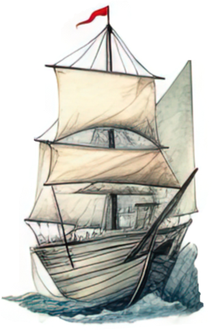

# Project 3 - Story Telling with Data Visualisations
_Data Analytics BootCamp (updated 26/07/2023)_
# Group 1
Contributors:  
David Baldwin, Juanita Sands, Tim Cook

We have been tasked with creating a HTML file to tell a story, that includes 3 data visualisations.

We have chosen to create our HTML page using a [geojson dataset](https://data.sa.gov.au/data/dataset/shipwrecks) of South Australian shipwrecks. The dataset includes all known shipwrecks in SA and adjacent waters.

To create the HTML page we have utilised [Python Flask-powered API](https://flask.palletsprojects.com/en/2.3.x/), [HTML/CSS](https://html.com/), [JavaScript](https://www.javascript.com/), [D3](https://d3js.org/), [Python](https://www.python.org/), [jupyter](https://jupyter.org/), [pyMongo](https://pymongo.readthedocs.io/en/stable/), [MongoDB](https://www.mongodb.com/), [Leaflet](https://leafletjs.com/), [Plotly](https://plotly.com/javascript/), [noUiSlider](https://refreshless.com/nouislider/) and [Bootstrap](https://www.bootstrapcdn.com/).

While the dataset contains a lot of data, our visualisation and story telling focused on: Build date, Loss date, Country, Hull description, Loss cause, region and Rig Description (type of ship).

**Installation:**

Please clone the github and then perform the following to allow the HTML file to run correctly:
- run [main.ipynb](main.ipynb)
- run [app.py](app.py)
- install [Flask Cors](https://pypi.org/project/Flask-Cors/) if not already installed
- setup a [local host](https://developer.mozilla.org/en-US/docs/Learn/Common_questions/Tools_and_setup/set_up_a_local_testing_server)
- Load project in Google Chrome Incognito window

Please note:
- CORS errors due to local hosting have been different on all 3 of our machines, but as of now it is working on all 3 (2 windows, 1 mac). The IPYNB to create the mongo server functions slighty differently for each of us (due to the various use of / \ by local machines).

**Contents:**
- [app.py](app.py) - Flask Server
- [main.ipynb](main.ipynb) - Mongo db setup + flask setup
- [logic.js](static/js/logic.js) - main js file including mapping and click monitoring
- [.js files](static/js) - js files with stand alone functions to support running of the main js file
- [style.css](static/css/style.css) - main file styling
- [TOPO_Shipwrecks_GDA2020.geojson](data/TOPO_Shipwrecks_GDA2020.geojson) - original geojson data file. Unfortunately the datasource does not have a live version, so can only be downloaded as .zip.
- [index.html](index.html) - html file for display.
- [Images](static/images) - includes icons for map and background image. Icons sourced from [Etsy](https://www.etsy.com/au/shop/GJBClipArts?ref=l2-about-shopname)
- [Presentation](Presentation/Presentation%20Slides.pptx) - Presentation outlining our project

  **Attributes**

  Code has been sourced from in class activities, along with the websites outline above for each code utilised, along with the assistance of sites such as stack overflow when errors arose.
